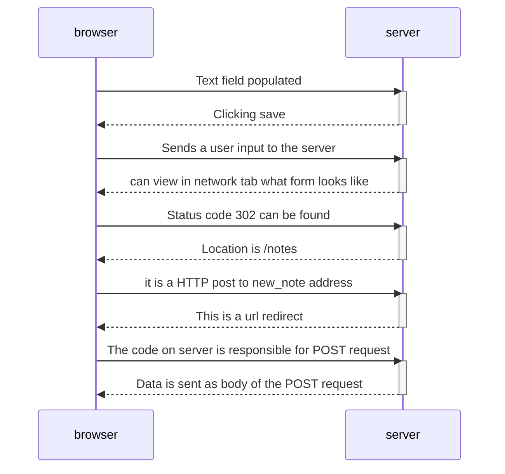

```mermaid
sequenceDiagram
    participant browser
    participant server

    browser->>server: Text field populated
    activate server
    server-->>browser: Clicking save
    deactivate server

    browser->>server: Sends a user input to the server
    activate server
    server-->>browser: can view in network tab what form looks like
    deactivate server

    browser->>server: Status code 302 can be found
    activate server
    server-->>browser: Location is /notes
    deactivate server

    browser->>server: it is a HTTP post to new_note address
    activate server
    server-->>browser: This is a url redirect
    deactivate server

    browser->>server: The code on server is responsible for POST request
    activate server
    server-->>browser: Data is sent as body of the POST request
    deactivate server

```