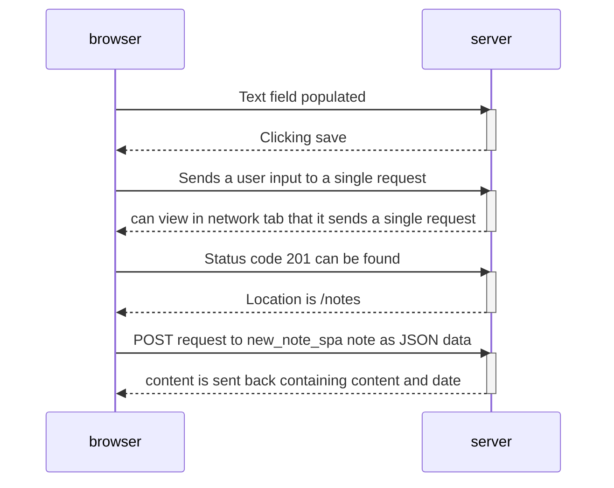

```mermaid
sequenceDiagram
    participant browser
    participant server

    browser->>server: Text field populated
    activate server
    server-->>browser: Clicking save
    deactivate server

    browser->>server: Sends a user input to a single request
    activate server
    server-->>browser: can view in network tab that it sends a single request
    deactivate server

    browser->>server: Status code 201 can be found
    activate server
    server-->>browser: Location is /notes
    deactivate server

    browser->>server: POST request to new_note_spa note as JSON data
    activate server
    server-->>browser: content is sent back containing content and date
    deactivate server

```